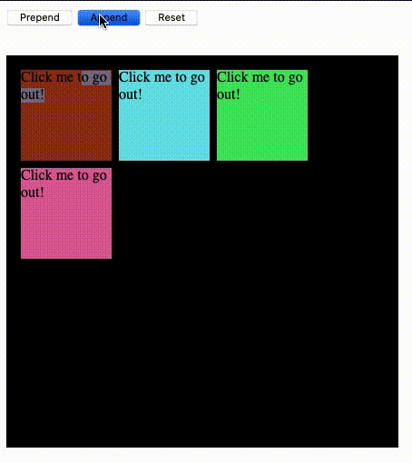
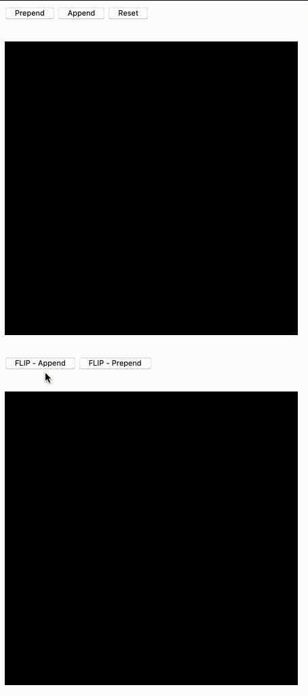

# stroudjs

A slim library of helper functions for use in vanilla JS projects (ES6+).

For those moments you want jQuery, but don't need all of it (this doesn't use jQuery-like things).

## DOM Helpers

### `searchForOne()` and `searchForAll()`

Writing ```document.querySelector()``` or ```document.getElementById()``` grows tedious.

```language-javascript
const searchForOne = (string) => document.querySelector(string)
const searchForAll = (string) => document.querySelectorAll(string)
```

### `createElement()`

- `element` - The element to create
- `attributes` - Object containing attributes to set: ```element.setAttribute(key, value)```
  - `{class: 'foo', "data-id": 'bar'}`
- `innerText` - The innerText to set on the element

```language-javascript
const createElement = (tag, attributes = null, innerText = null) => {
  const element = document.createElement(tag)
  if (attributes) {
    const valuePairs = Object.entries(attributes)
    valuePairs.forEach((a) => {
      const [key, value] = a
      element.setAttribute(`${key}`, value)
    })
  }
  if (typeof innerText === 'string') {
    element.innerText = innerText
  }
  return element
}
```

If you're familiar with [ExtJs](https://docs.sencha.com/extjs/6.2.0/index.html) then this may look somewhat familiar:

```language-javascript
 const childDiv = createElement(
      'div',
      {
        class: 'child'
      },
      'Click me to go out!'
    )
```

### `createSVG()`

A wrapper around ```document.createElementNS()``` with helpers for setting attributes.

- `tag` - The SVG element to create, such as 'svg', 'path', 'g', so on
- `attributes` - (Optional) Object containing attributes to set: ```element.setAttribute(key, value)```
attributes.attributeName - The element attribute you wish to set and its value
- `viewBox` - Array containing width and height as integers to set for the viewbox
- `dimensions` - Set a width and height different from viewBox if needed. Can be numbers or strings representing a percentage. If not provided, ```viewBox``` array is used

```language-javascript
const createSVG = (tag, attributes, viewBox, dimensions) => {
  const xmlns = 'http://www.w3.org/2000/svg'
  const svgElement = document.createElementNS(xmlns, tag)
  if (tag === 'svg') {
    const [width, height] = viewBox
    svgElement.setAttribute('viewBox', `0 0 ${width} ${height}`)
    if (dimensions) {
      const [diffWidth, diffHeight] = dimensions
      svgElement.setAttribute('width', diffWidth)
      svgElement.setAttribute('height', diffHeight)
    } else {
      svgElement.setAttribute('width', width)
      svgElement.setAttribute('height', height)
    }
  }
  if (attributes) {
    const valuePairs = Object.entries(attributes)
    valuePairs.forEach((a) => {
      const [key, value] = a
      svgElement.setAttribute(`${key}`, value)
    })
  }
  return svgElement
}
```

### `nestElements()`

Append elements to a given parent element.

- `parent` - The parent node to which children will be appended
- `children` - Array of children elements that will go inside ```parent```
  
```language-javascript
const nestElements = (parent, children) => {
  children.forEach((c) => {
    parent.appendChild(c)
  })
  return parent
}
```

### `removeNodes()`

Iteratively remove nodes from the DOM.

- `nodes` - Array of nodes to remove from the DOM.
- `callback` - Optional callback to perform when done

```language-javascript
const removeNodes = (nodes, callback) => {
  nodes.forEach((n) => {
    n.remove()
  })
  if (typeof callback === 'function') {
    callback()
  }
}
```

### `empty()`

Remove children nodes from a parent node. Useful for nodes whose content is populated by ```fetch()``` results.
A callback can be called at the end of this event if needed.

```language-javascript
const empty = (parent, callback) => {
  while (parent.lastChild) {
    parent.removeChild(parent.lastChild)
  }
  if (typeof callback === 'function') {
    callback()
  }
}
```

## Animation Helpers

These were inspired by my experience with the Svelte framework. 

Refer to [this talk](https://www.youtube.com/watch?v=FxMyqxc8Fx0) from Svelte Summit 2020 for how Svelte handles animation. The presenter Tan Li Hau demonstrates how one would write something like Svelte's transition function using vanilla language-javascript.

### `transition()`

Give appended/prepended nodes a smooth entrance and give them a smooth exit.

- `flag` - Assign 'in' or 'out' depending on whether your element is entering or exiting the DOM
- `node` - The element that is entering or exiting the DOM
- `params` - The parameters object for the CSS or JS animation

`params` is based on Svelte's "transition contract. The default params look like this:

```language-javascript
params = {
  duration: 300,
  delay: 0,
  easing: linear,
  css: (t, u) => `transform: translate(-${t * 50}px, ${t * 50}px)`,
  tick: (t, u) => (t === 1 ? (node.style.animation = '') : '')
}
```

Refer to `easings.js` for the easing functions. These take the place of writing `cubic-bezier()` in a CSS file.

The transition function creates keyframes for the transition animation, adds them to a style sheet, and runs the animation.
Both CSS and JS animations are possible with this function.


If the transitioning node has siblings, those siblings are animated such that they smoothly fill in empty space left by the removed nodes and they smoothly make space for prepended nodes. 

*The neighboring nodes will take on the parameters given to the outgoing element.* So, if an outgoing element's `params` argument includes `{duration: 1000, delay: 100, ...}` then the neighboring nodes will receive the same.


### ⚠️ Caveat ⚠️

If your outgoing transition's duration is set to >= 1000, then too many simultaneously-exiting nodes will cause shifting nodes to not complete their animations.



### `flip()`

The flip function allows one to have a node transition out from one element and transition into another one.

`target` - The parent node taking in the new element
`flag` - Either 'append', which will call ```target.appendChild(node)``` or 'prepend' which calls ```target.prepend(node)``` node The node being moved to ```target```
`callback` - Execute code when flip has completed



### 🕷 Known Issues 🕷

- `animation.js`: Inability to customize the `params` argument for neighboring nodes
  - May cause negative side effects in certain cases, but will need testing
- `animation.js`: Using `flip()` seems to not work well with `unshiftSiblings()` as animations seem to end prematurely if there are multiple nodes flipping
